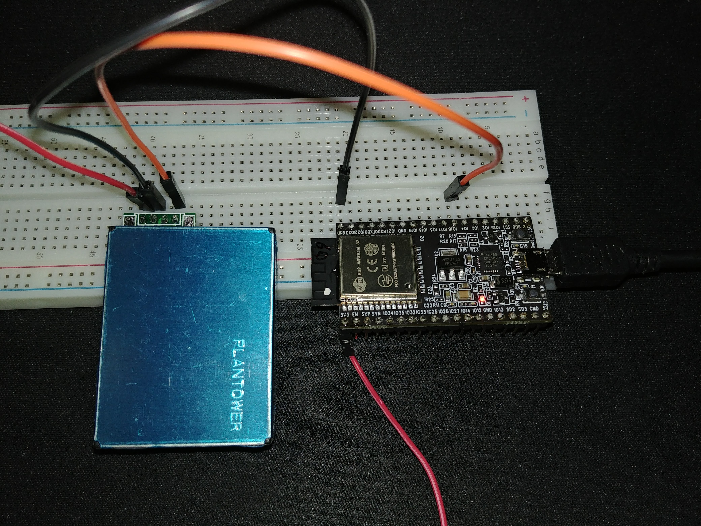
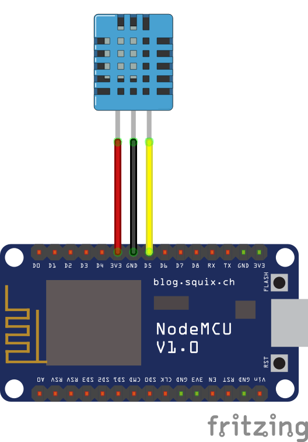

# Hackaton IoT 2018 - Device

## General Rules:
- never connect directly positive and negative power wires
- never change connections when the circuit is powered
- be careful not to short-circuit accidentally any pins or other parts on  components
- before turning power on make sure all connections are correct and there is no short circuits
- never connect 5V output directly into a component working on 3.3V logic level


## Requirements:
- Linux / OSX
- Python 3.6
- CP210x USB to UART (OSX only)
- ampy
- Mosquitto-clients
- esptool.py
- picocom

## Installation:
### CP210x USB to UART:
OSX: [driver](https://www.silabs.com/documents/public/software/Mac_OSX_VCP_Driver.zip)


### Ampy:
[github](https://github.com/adafruit/ampy)  
Linux / OSX:

```bash
pip install adafruit-ampy
```

### Mosquitto-clients:
[mosquitto](https://mosquitto.org)  
Linux:

```bash
sudo apt-get install mosquitto-clients
```
OSX:

```bash
brew install mosquitto
```


### Esptool.py:
[esptool](https://github.com/espressif/esptool)  
Linux / OSX:

```bash
pip install esptool
```


### Picocom:
[picocom](https://github.com/npat-efault/picocom)  
Linux:

```bash
sudo apt-get install picocom
```

OSX:

```bash
brew install picocom
```

## MicroPython
> MicroPython is a lean and efficient implementation of the  [Python 3](http://www.python.org/) programming language that includes a small subset of the Python standard library and is optimised to run on microcontrollers and in constrained environments.

### Getting started:
1. Download correct firmware from MicroPython website  
	ESP8266: [esp8266](http://micropython.org/download#esp8266)  
	ESP32: [esp32](http://micropython.org/download#esp32)
2. Connect device and identify a new device under `/dev/` directory
3. Flash firmware using esptool.py

	**ESP8266:**

	```bash
	esptool.py --port /dev/device_file erase_flash
	esptool.py --port /dev/device_file --baud 460800 write_flash --flash_size=detect 0 firmware.bin
	```

	**ESP32:**

	```bash
	esptool.py --chip esp32 --port /dev/device_file write_flash -z 0x1000 firmware.bin
	```

	**Warning:**
	Make sure to use correct flashing command for ESP32.  
	If you do not specify starting address with flag `-z 0x1000` you will brick the device.

4. Connect to the device using picocom to get MicroPython REPL (prompt)

```bash
picocom /dev/ttyUSB0 -b115200
# if previous command does not return a prompt try the following one
picocom /dev/ttyUSB0 -b9600
```


### Reference:
- [Getting started](https://docs.micropython.org/en/latest/esp8266/esp8266/tutorial/intro.html#)
- [Boot process](https://docs.micropython.org/en/latest/esp8266/esp8266/general.html#boot-process)
- [MicroPython libraries](https://docs.micropython.org/en/latest/esp8266/library/index.html#)
- [MicroPython differences from Python 3](https://docs.micropython.org/en/latest/esp8266/genrst/index.html)

## Parts
### ESP32-DevKitC ESP32 WiFi + BT 4.2

**Description:** A MicroPython-compatible microcontroller.
CPU 32-bit 160 Mhz, 520 KB SRAM
Integrated WiFi and BT module.
Uses 3.3V logic level.
Can be powered with 5V power supply

**Purpose:** Use it in the final device to connect all components.

### ESP8266 NodeMCU v2 microcontroller

**Description:** A MicroPython-compatible microcontroller.
Integrated WiFi module
Uses 3.3V logic level.

**Purpose:** Use it for development with a single component.

### PMS7003 Air quality sensor

**Description:** Air quality sensor capable of measuring particle pollution in ranges: PM1.0, PM2.5, PM10.

### Adapter IDC 10pin 1,27mm - JST 1,25mm

**Description:**
Adapter for PMS7003 air quality sensor

### OLED display 1,3'' 128x64px I2C v2

**Description:** Uses 3.3V or 5V logic level.
Supports I2C communication protocol.

**Purpose:** Use it to display information gathered by the device.

### DHT11 temperature / humidity sensor

**Description:** Collects information about temperature and relative humidity.
Temperature is measured in range from 0°C to 50°C and 2°C precision.
Humidity is measured in range 20% to 90% and ± 5%

**Purpose:** Use it collect information about current temperature and humidity.

### LED Ring RGB WS2812B 5050 x 8

**Description:** LED Ring composed of 8 addressable RGB LED.
Powered by 5V, consumes 18mA per LED, with a total power consumption of 150mA.

**Purpose:** Can be used to provide visual feedback from the device and represent gathered data.

### Sparkfun 2-way, 4-channel logic converter

**Description:** Logic level converter, allows for safe communication of 3.3V and 5V level components.
Requires 3.3V and 5V power input.
Converts 3.3V into 5V and 5V into 3.3V.

**Purpose:** Used to ensure 5V component ouputs do not damage 3V components and to ensure 3V component outputs are correctly read by 5V components.

### LM2596 3,2V-35V 3A step-down power converter

**Description:** Step-down converter. Converts input voltage in range 3.2V - 40V to voltage in range 3.2V - 35V (set with potentiometer)
Maximum power draw of 3A.

**Purpose:** Use it to convert 5V provided by USB Power Supply to 3.3V.

### microUSB socket

**Purpose:** Use it with the LED Ring to provide power from USB Power Supply.

### Breadboard 830 tie-points
### microUSB 5V / 2,5A power supply
### microUSB B - A cable
### Connection wires 20cm


## Components
Below listed are components that will constitute the final device. Each component can be worked on separately using an ESP8266 NodeMCU v2 microcontroller.

### PMS7003 Air quality sensor
**Difficulty:** High

**Task:** Wire up the parts and write a MicroPython module, which will collect, parse and return sensor data. Writing a driver for the sensor took us quite some time to implement, so if you want you can use the [driver](https://github.com/pkucmus/micropython-pms7003) we already have.

**Caveat:**
The data sheet for this sensor will tell you to run it from 5V, this was not the case - for whatever reason it has to be ran from 3.3V to have proper readings.

**Parts:**
- ESP32-DevKitC ESP32 WiFi + BT 4.2
- PMS7003 Air quality sensor
- Adapter IDC 10pin 1,27mm - JST 1,25mm
- microUSB B - A cable
- Breadboard

**Boilerplate:**

```python
from pms7003 import PMS7003

pms = PMS7003()
pms_data = pms.read()
```

**Connection:**



**Reference:**
- [specification](https://botland.com.pl/index.php?controller=attachment&id_attachment=2182) (Appendix 1)

### LED Ring RGB WS2812B 5050 x 8
**Difficulty:** Medium

**Task:** Wire up the parts and write a MicroPython module, which will provide a visual feedback given the data collected by sensors and the state of the device. You have freedom in choosing how the ring will represent the data and how it will interact with other components.

**Parts:**
- ESP8266 NodeMCU v2 microcontroller
- LED Ring RGB WS2812B 5050 x 8
- microUSB 5V / 2,5A power supply
- microUSB B - A cable
- microUSB socket
- Sparkfun 2-way, 4-channel logic converter
- breadboard

**Boilerplate:**

```python
import machine, neopixel
np = neopixel.NeoPixel(machine.Pin(4), 8)
np[0] = (255, 0, 0)
np.write()
```

**Connection:**


**Reference:**
- [neopixel](https://docs.micropython.org/en/v1.8/esp8266/esp8266/tutorial/neopixel.html)

### OLED display 1,3'' 128x64px I2C v2
**Difficulty:** Medium

**Task:** Wire up the parts and write a python module, which will communicate with OLED display. The display can render data gathered from sensors and the state of the device. You have freedom in choosing what information will be rendered on display and how it will be rendered.

**Parts:**
- ESP8266 NodeMCU v2 microcontroller
- OLED display 1,3'' 128x64px I2C v2
- microUSB B - A cable
- breadboard

**Boilerplate:**

```python
import sh1106
from machine import I2C, Pin

i2c = I2C(-1, Pin(5), Pin(4))
display = sh1106.SH1106_I2C(128, 64, i2c, Pin(14))
display.fill(1)
display.show()
display.fill(0)
display.show()
```

**Connection:**


**Reference:**
- [driver](https://github.com/robert-hh/SH1106/blob/master/sh1106.py)


### Temperature and Humidity Sensor
**Difficulty:** Low

**Task:** Wire up the parts and write a python module which will collect, parse and return data from temperature and humidity sensor

**Parts:**
- ESP8266 NodeMCU v2 microcontroller
- DHT11 temperature / humidity sensor
- microUSB B - A cable

**Boilerplate:**

```python
import dht
import machine
d = dht.DHT11(machine.Pin(4))
d.measure()
d.temperature()
d.humidity()
```

**Connection:**



**Reference:**
- https://docs.micropython.org/en/latest/esp8266/esp8266/tutorial/dht.html

### MQTT - api integration
**Difficulty:** Medium

**Task:** Write a python module which will communicate with MQTT server and send data collected from the sensors.

**Parts:**
- ESP8266 NodeMCU v2 microcontroller
- microUSB B - A cable

**Boilerplate:**

```python
from umqtt.simple import MQTTClient
client = MQTTClient('<device_id>', '10.93.1.22')
client.connect()
```

**Reference:**
- https://github.com/micropython/micropython-lib/tree/master/umqtt.simple
- [MQTT message schema](MQTT_SCHEMA.yaml)


## Recipes / FAQ:
- I want to connect to WiFi

```python
def do_connect():
    import network
    sta_if = network.WLAN(network.STA_IF)
    if not sta_if.isconnected():
	print('connecting to network...')
	sta_if.active(True)
	sta_if.connect('<essid>', '<password>')
	while not sta_if.isconnected():
	    pass
    print('network config:', sta_if.ifconfig())
```

- I want to upload a file to microcontroller

    ```bash
    ampy --port /dev/device put filename
    ampy --port /dev/device ls # optionally list files on device for confirmation
    ```
    **Warning:**
    There is a known bug in ampy, which may cause file upload to fail for ESP32.  
    If you encounter the issue please follow the following steps:

    1. Prepare the upload command in the terminal
    2. Reset device
    3. Press enter about 2-5 seconds after pressing reset button. The timing is tricky and it may not work each time.

- My device is frozen and does not respond to commands:
Pressing Ctrl-C will stop currently running command and return to prompt.
Pressing Ctrl-D on a blank line will perform a soft-reset.
This will reset virtual machine and return a new prompt.
Note, that it does not reset hardware peripherals (WiFi included).

- I am suck and I cannot communicate with the device:
In this case a re-flash of MicroPython may be required.
Please refer to MicroPython Getting Started section for instructions.

- How can I debug MQTT traffic?:
Package `mosquitto-clients`  comes with binaries that can be used to subscribe to existing traffic and publish new messages:

```bash
mosquitto_pub -h 10.93.1.22 -t topic -m message # publish a new message on specified topic
mosquitto_sub -h 10.93.1.22 -t topic # subscribe to messages published on specified topic
```

